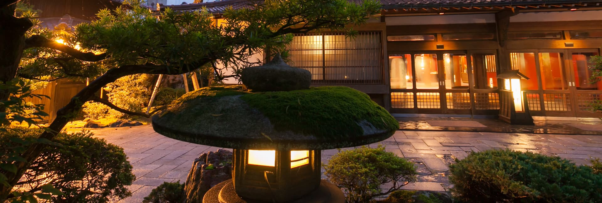
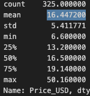
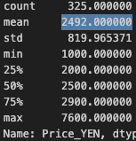

 
 
# Exploratory Data Analysis in Python
 
The purpose of the project is to give insight to stakeholders who are solo traveling to Japan in the near future and want to stay in a hostel but would like more information on them.
## Data Set Used

 - [Japan Hostel Dataset](https://www.kaggle.com/datasets/koki25ando/hostel-world-dataset/data)
## Environment Used

- Virtual Environment inside of VS Code running ```Python3```

- ```Jupyter Notebook``` inside of VS Code


## Libraries Used

- ```pandas```
- ```matplotlib```
- ```seaborn```
## Research Questions & Answers

1. [What's the average price of a hostel for 1 night?](#1-whats-the-average-price-of-a-hostel-for-1-night)
    - ``$16.45 USD`` or ``¥2492 YEN``

2. [Does the city of the hostel change the price?](#2-does-the-city-of-the-hostel-change-the-price)
    - ``Yes``, however only slightly. The highest average-priced city for a hostel is Tokyo coming in at around $17.85 USD (¥2752.61 YEN) and the lowest-priced city Kyoto comes in at around $14.78 (¥2279.19 YEN). The other major cities like Osaka, Fukuoka-City, and Hiroshima fall in between these two prices.

3. [Does the distance from the center of the city affect pricing?](#3-does-the-distance-from-the-center-of-the-city-affect-pricing)
    - Overall ``No``, distance does not seem to affect the pricing of the hostels as ones that are closer to the city center are priced around the same as ones found 5-10 miles away.

4. [What city has the most and least hostels?](#4-what-city-has-the-most-and-least-hostels)
    - ``Tokyo`` has the most with 122 while ``Hiroshima`` has the least with 14. 

5. [What city has the best and worst-rated hostels on average?](#5-what-city-has-the-best-and-worst-rated-hostels-on-average)
    - ``Hiroshima`` has the best rate at 9.2 and ``Osaka`` has the worst rate at 8.6. Although Osaka has the worst rating on average, the rating itself is still very good. The other major cities like Tokyo, Fukuoka-City, and Kyoto fall in between these two ratings.

6. [What ratings does each city have?](#6-what-ratings-does-each-city-have)
    - ``Tokyo`` has 66 "superb" rated hostels.
    - ``Osaka`` has 50 "superb" rated hostels.
    - ``Kyoto`` has 46 "superb" rated hostels.
    - ``Hiroshima`` has 11 "superb" rated hostels.
    - ``Fukuoka-city`` has 9 "superb" rated hostels.

7. [How do various aspects of hostel experience correlate with each other?](#7-how-do-various-aspects-of-hostel-experience-correlate-with-each-other)
    - Overall most of the main hostel aspects (Atmosphere, Cleanliness, Location, Value for Money, etc.) that people think about when deciding which places to stay at ``correlate highly`` to each other. Some <ins>notably high ones are the correlations between Facilities and Cleanliness (0.80), and Facilities and Value for Money (0.75)</ins>. With the high correlations between the two, I would suggest people look at hostels with highly rated Facilities if some of their top priorities are value for money and cleanliness. Some <ins>notably low ones are the correlations of Price and Distance</ins>. In almost all columns looked at with these two aspects the correlations were negative. This would suggest that price and distance do not play a key role in deciding if a hostel will be a desirable place to stay.

## Preparation

#### Before Cleaning
```python
df.sample(5)
``` 
   

#### After Cleaning
```python
df.sample(5)
``` 
   
## Analysis

#### 1. What's the average price of a hostel for 1 night? [Back to QA](#research-questions--answers)
     
#### 2. Does the city of the hostel change the price? [Back to QA](#research-questions--answers)
   
#### 3. Does the distance from the center of the city affect pricing? [Back to QA](#research-questions--answers)
   
#### 4. What city has the most and least hostels? [Back to QA](#research-questions--answers)
   
#### 5. What city has the best and worst-rated hostels on average? [Back to QA](#research-questions--answers)
   
#### 6. What ratings does each city have? [Back to QA](#research-questions--answers)
   
#### 7. How do various aspects of hostel experience correlate with each other? [Back to QA](#research-questions--answers)
   
## Limitations

This is an older dataset with only the information based on the time it was gathered. This means that prices and ratings in the analysis can be slightly inaccurate when comparing them to the current prices and ratings of these hostels.
## Conclusion

Solo travelers looking to explore Japan have <ins>many options to choose from in many major cities</ins> however some cities have significantly more options than others. Travelers looking for inexpensive places to stay while still being close to the city to explore can find peace knowing that <ins>distance does not play a major role in determining the price of a hostel</ins>. While these hostels are <ins>fairly priced this does not mean that they lack in other areas such as the quality of the facilities or how clean</ins> they are.
